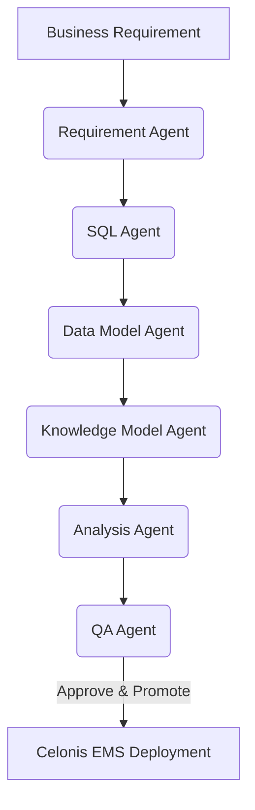

# Celonis Multi-Agent Workflow Orchestrator: System Documentation

This document describes the technical architecture, database schemas, agent workflows, and deployment integrations of the **Celonis Multi-Agent Workflow Orchestrator** based on the current codebase status.

---

## 🛠️ System Overview

The **Celonis Multi-Agent Workflow Orchestrator** is an automated pipeline designed to ingest business process requirements, generate database transformations, map data models, define semantic KPI layers (Knowledge Models), design Studio dashboards (Views), perform compliance QA, and programmatically deploy all assets directly to a **Celonis EMS** instance.

---

## 📅 Work Completed Till Mid-Sem

Below is a detailed breakdown of the functionality, architecture, and features that have been fully implemented and verified up to the mid-semester milestone. A developer reading this section can understand the complete state of the project:

### 1. Multi-Agent Workflow Orchestration Engine
*   **Sequential Stage Control**: Implemented a workflow state machine (**[backend/app/orchestrator.py](file:///Users/hemanttanwar/Documents/hemant_process_mine/backend/app/orchestrator.py)**) that enforces progression across 6 stages:
    `Requirement Analysis` ➔ `SQL Transformation` ➔ `Data Modeling` ➔ `Knowledge Modeling` ➔ `View/Analysis Design` ➔ `QA Validation` ➔ `Completed (Production Promoted)`.
*   **Session State Machine**: Configured automatic next-stage updates and dependency guards (e.g., you cannot run Data Modeling without approved SQL and Requirements artifacts).
*   **Role-Based Governance**: Simulated enterprise approval boundaries. Users can switch roles between **Business User**, **Process Analyst**, **Reviewer**, and **Admin**. Only Process Analysts/Admins can edit generated code, and only Reviewers/Admins can approve stages or trigger the production push.

### 2. Implementation of 6 Specialized AI Agents
Located under **[backend/app/agents/](file:///Users/hemanttanwar/Documents/hemant_process_mine/backend/app/agents)**, these agents inherit from a common `BaseAgent` that communicates with LLMs (e.g., Llama 3.1 70B/Claude) via AWS Bedrock:
*   **Requirement Analyzer Agent**: Translates raw text requirements into structured JSON specs mapping out source tables, event logs, case definitions, and target KPIs.
*   **Transformation SQL Agent**: Automatically writes Celonis-compatible SQL transformations. It extracts `CASE_KEY`, `ACTIVITY`, `EVENT_TIME`, and sorting index definitions.
*   **Data Model Agent**: Configures primary keys, foreign keys, and event-log-to-case mappings for Celonis.
*   **Knowledge Model Agent**: Autonomously drafts Celonis PQL (Process Query Language) semantic KPI formulas and process filters (such as Maverick Buying rates or automation rates).
*   **Analysis Agent**: Uses a custom **[Celonis Knowledge Base](file:///Users/hemanttanwar/Documents/hemant_process_mine/backend/app/celonis_knowledge_base.py)** to design layout grids, placing Process Explorers, OLAP tables, single KPI cards, and dropdown filters.
*   **QA Validation Agent**: Runs automated compliance checks against SQL query structures, PQL syntax rules, and requirement match matrices, outputting a detailed compliance score.

### 3. Live PyCelonis Deployment Engine
Integrated directly with the Celonis EMS Cloud API via the `pycelonis` Python SDK:
*   **Automated Pool & Model Provisioning**: Programmatically connects to Celonis to create Data Pools, map schemas, establish foreign key connections, link package variables, and register Studio workspaces.
*   **Data Source CSV Uploads**: Dynamically parses the generated transformation SQL, detects which source tables are needed, uploads only those CSVs from **[Data_source/](file:///Users/hemanttanwar/Documents/hemant_process_mine/Data_source)** to save API limits, and uploads empty mock tables for any missing references to prevent execution errors.
*   **Automatic SQL Self-Correction Loop**: During promotion, if the Celonis execution engine encounters an error, the backend catches the API exception, extracts the error trace, feeds it back into the **Transformation SQL Agent**, re-generates the corrected query, commits the new version to the database, and retries the deployment (up to 3 times).

### 4. Interactive Frontend Cockpit
A modern React dashboard built using Vite, TypeScript, and dark-theme vanilla CSS:
*   **Cockpit Dashboard**: Displays live execution logs, session statuses, current roles, and lists of all versioned artifacts.
*   **Visual Editor & Git-like Diff Viewer**: Allows Process Analysts to manually edit generated SQL or YAML configurations, provide rationales, and save new versions directly to the database.
*   **Audit Logger**: Displays real-time governance trails (logs of runs, edits, approvals, and error outputs) directly from the database audit log.

### 5. Database Schema & Persistence
An SQLite relational database (**[backend/app/database.py](file:///Users/hemanttanwar/Documents/hemant_process_mine/backend/app/database.py)**) with ORM models representing:
*   `sessions`: Tracks workflow state, roles, metadata, and timestamps.
*   `artifacts`: Versioned repository storing LLM outputs, manual user edits, and approvals.
*   `audit_logs`: Detailed tracking logs of start events, agent prompt-response cycles, errors, and approvals.

---

## 📂 Repository Architecture

The codebase is split into two primary components:

*   **[backend/](file:///Users/hemanttanwar/Documents/hemant_process_mine/backend)**: A FastAPI server running Python 3.9+ coordinates database state management, agent executions, and the Celonis PyCelonis API integration.
*   **[frontend/](file:///Users/hemanttanwar/Documents/hemant_process_mine/frontend)**: A React SPA (TypeScript + Vite) providing a multi-role interactive cockpit interface.
*   **[projects/](file:///Users/hemanttanwar/Documents/hemant_process_mine/projects)**: Local exports of completed deployment packages containing compiled SQL, YAML models, and Markdown runbooks.
*   **[Data_source/](file:///Users/hemanttanwar/Documents/hemant_process_mine/Data_source)**: CSV files representing raw database tables (e.g., SAP EBELN purchase logs) uploaded directly to Celonis during deployment.

---

## 🗄️ Database Schema & Models

The system runs on SQLite managed through SQLAlchemy ORM in **[backend/app/database.py](file:///Users/hemanttanwar/Documents/hemant_process_mine/backend/app/database.py)**. The schema consists of three core tables:

### 1. `sessions` (`SessionModel`)
Tracks the lifecycle of an orchestration session.
*   `id`: Primary Key (UUID String)
*   `name`: Session Name (e.g., "Procure to Pay Optimization")
*   `description`: Original text requirement submitted by the business user.
*   `status`: Current workflow stage (`requirement_analysis`, `sql_transformation`, `data_modeling`, `knowledge_modeling`, `analysis_generation`, `qa_validation`, `completed`).
*   `current_role`: Restricts operations to authorized actors (`Business User`, `Process Analyst`, `Reviewer`, `Admin`).

### 2. `artifacts` (`ArtifactModel`)
Stores versioned outputs generated by each agent or edited manually.
*   `id`: Primary Key (Autoincrement Integer)
*   `session_id`: Foreign Key referencing `sessions.id`
*   `stage`: The creator stage (`requirement`, `sql`, `data_model`, `knowledge_model`, `analysis`, `qa`).
*   `version`: Auto-incrementing version number for tracking edits/re-generations.
*   `content`: Raw text content (JSON specifications or SQL code).
*   `rationale`: Explanation generated by the LLM agent outlining its choices.
*   `approved`: Boolean flag set by a Reviewer/Admin.

### 3. `audit_logs` (`AuditLogModel`)
Provides comprehensive governance tracking for all human and agent actions.
*   `id`: Primary Key (Autoincrement Integer)
*   `session_id`: Foreign Key referencing `sessions.id`
*   `stage`: Affected stage.
*   `agent_name`: Name of the triggering agent or user role.
*   `action`: Action type (`run_started`, `run_completed`, `run_failed`, `approved`, `rejected`, `edited`).
*   `prompt` / `response` / `error`: Detailed audit trails.

---

## 🤖 The Multi-Agent Pipeline

The orchestrator (**[backend/app/orchestrator.py](file:///Users/hemanttanwar/Documents/hemant_process_mine/backend/app/orchestrator.py)**) sequentially coordinates six specialized agents found under **[backend/app/agents/](file:///Users/hemanttanwar/Documents/hemant_process_mine/backend/app/agents)**:

1.  **[Requirement Analyzer Agent](file:///Users/hemanttanwar/Documents/hemant_process_mine/backend/app/agents/requirement_agent.py)**: Translates plain-text descriptions into a structured JSON business requirement specification containing scope, activities, tables, and target KPIs.
2.  **[Transformation SQL Agent](file:///Users/hemanttanwar/Documents/hemant_process_mine/backend/app/agents/sql_agent.py)**: Generates database ETL scripts mapping source CSV headers to process-mining case keys, activity logs, timestamps, and indexes.
3.  **[Data Model Agent](file:///Users/hemanttanwar/Documents/hemant_process_mine/backend/app/agents/data_model_agent.py)**: Configures mapping details, linking primary keys and foreign keys between the case table and the event log.
4.  **[Knowledge Model Agent](file:///Users/hemanttanwar/Documents/hemant_process_mine/backend/app/agents/knowledge_model_agent.py)**: Establishes Celonis PQL (Process Query Language) semantic definitions, formulas, and process filters.
5.  **[Analysis Agent](file:///Users/hemanttanwar/Documents/hemant_process_mine/backend/app/agents/analysis_agent.py)**: Configures Studio view components (Process Explorer, OLAP tables, single-KPI cards, and dropdown filters) based on the **[Celonis Knowledge Base Reference](file:///Users/hemanttanwar/Documents/hemant_process_mine/backend/app/celonis_knowledge_base.py)**.
6.  **[QA / Validation Agent](file:///Users/hemanttanwar/Documents/hemant_process_mine/backend/app/agents/qa_agent.py)**: Evaluates generated SQL syntaxes, PQL formulas, and safety rules, returning a score out of 100 and a list of structural recommendations.

---

## 🚀 Celonis Platform Integration & Promotion

When a session is promoted in **[backend/main.py](file:///Users/hemanttanwar/Documents/hemant_process_mine/backend/main.py#L237)**, the deployment engine programmatically pushes assets to Celonis:

### 1. Resource Provisioning
*   **Data Pool**: Creates/connects to a dedicated Celonis Data Pool.
*   **CSV Uploader**: Reads raw data from the **[Data_source/](file:///Users/hemanttanwar/Documents/hemant_process_mine/Data_source)** directory and uploads only the tables referenced in the SQL script to save API bandwidth.
*   **Mock Generator**: Scans the transformation SQL for any referenced source tables missing from `Data_source` and uploads empty mock templates to ensure validation succeeds.

### 2. SQL Self-Correction Loop
*   Applies a Celonis Data Job execution and waits for validation status.
*   If compilation fails, the system fetches the detailed Celonis error log and invokes the **Transformation SQL Agent's self-correction module** (`TransformationSQLAgent.fix_error`).
*   The agent fixes the syntax on-the-fly, saves the updated code as a new version in the database, and retries the execution (up to 3 times).

### 3. Semantic Layer & Analysis Publishing
*   **Data Model**: Maps event logs, assigns foreign keys, sets `CASE_KEY` / `ACTIVITY` / `EVENT_TIME` process configurations, and reloads the model.
*   **Package Variable**: Creates a package variable pointing to the newly compiled Data Model.
*   **Knowledge Model**: Publishes KPI formulas and filters formatted in YAML using the package variable.
*   **Studio Analysis**: Provisions clean multi-sheet dashboards mapped to the semantic layer.

### 4. Local Archive Generation
All generated configurations are archived under **`projects/<session_slug>/`**:
*   `business_requirement_spec.json` (Requirements schema)
*   `transformations.sql` (Final successful SQL script)
*   `datamodel.json` (Data Model configurations)
*   `knowledge_model.yaml` (Semantic KPI definitions)
*   `celonis_analysis_spec.json` (Studio UI layout specs)
*   `qa_validation_checklist.json` (Compliance reports)
*   `deployment_runbook.md` (Self-contained step-by-step instructions)
